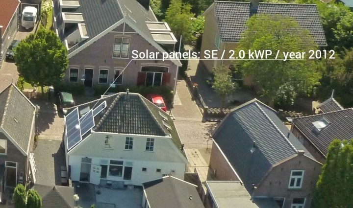

- - -

* Table of Content
{:toc}

- - -

## Smart weather data filtering using a 3D city model

[Netatmo](https://www.netatmo.com/) sells low-cost personal weather stations that anyone can buy, and so there are now close to [1000 stations](https://weathermap.netatmo.com) in The Hague, Delft and the surrounding areas! By default, Netatmo owners share their data publicly, but like all crowdsourced datasets, it is all quite messy. The stations' locations are only roughly known, some outdoor modules are in the sunlight (at certain times), have different exposure to the wind, etc.

The aim of the project is to *improve the dataset by using the 3D model of The Hague to filter the data in a smart way*. For instance, maybe we can find out if some of the stations are not located in the places where they say they are, or maybe some of the stations' readings are reliable only during certain periods of the day due to the sunlight hitting them directly.

For this project, the student should be able to program well enough to read a CityGML model and to do analyses with geometric operations (such as casting shadows). C++ programming would be ideal but any other language should be good enough.

*Contact:* [KeAr](http://tudel) or Alexander Wandl

- - -

## Extraction of 3D roof segments from aerial imagery 

{:width="350px"}

This project is done in cooperation with [Readaar](http://www.readaar.com).
Readaar already developed a method to efficiently determine 3D roof segments from LiDAR data. 
Their current method is extremely fast (less than 2 days to process the entire Netherlands on a normal workstation) and gives a coarse estimation (~1m planar accuracy) of all roof segments in the Netherlands. 
They want to upgrade their current method to combine LiDAR with aerial imagery to profit from the much higher resolution of imagery w.r.t. LiDAR. 
There are multiple ways to achieve this, which could be focused more on traditional point cloud processing methods or more on object detection/machine learning approaches.
Both stereo imagery and LiDAR data are available for the entire Netherlands. 

The student will be helped by a remote sensing specialist (ir. Sven Briels) and a machine learning expert (Jean-Michel Renders, PhD) from [Readaar](http://www.readaar.com), and supervisors from TU Delft.

For this position we ask for programming skills, preferably in Matlab. 
The student will have to develop and test a large number of algorithms and approaches to get information from the raw data.

[More information is found there.](http://jobs.readaar.com/blog/internship-remote-sensing-machine-learning)

*Contact:* [Ho Ledx](http://tudelft.ux) 

- - -

## 3D reconstruction of doors and windows from point clouds

Doors and windows are of critical importance for indoor navigation and localisation, but very difficult to identify from point clouds: doors and windows can be closed or open during the scanning, windows can be covered with curtains or sun shutters.  This research will concentrate investigated which outdoor approach could be appropriate for indoor environments. Recently completed research of [Kau](http://repository.1/) could be used as starting point. Different approaches can lead to different MSc topics: use of floor plans, semi-automatics, feature detection, etc. (Required skills: interest in processing point clouds, programming or alternatively using existing software)

*Contact*: [Sva](http://3d.bk.), Ben (

- - - 

## Colouring point clouds obtained from ZEB1

Scanning indoor environments with ZEB1 is quick and accurate method for obtaining indoor point clouds. However,  the point clouds don’t have colour. This research will investigate an approach for integrating images with the ZEB1 point clouds to obtain coloured points. The research will be in collaboration with CSIRO, GeoSlam and university of Picardie. (Required skills: interest in processing point clouds, programming)

*Contact*: [Sva](http://3d.bk.t) (in cooperation with LE)

- - - 

## Smart City 

Connecting and visualizing real-time sensors with point cloud. Used for analysis of data and influencing the environment (smart city concept). Details to be provided later. 

*Contact*: [S](http://3d.bk.tu) an

